<!-- HEADER BANNER -->

  

<!-- ABOUT ME -->
<h2 align="center">Sobre Mí</h2>

  Ingeniero de Software en formación con nivel de <b>inglés C1 (avanzado)</b> y más de <b>15 certificaciones técnicas</b>, especializado en llevar productos digitales desde el diseño técnico y arquitectónico (MVC, capas, Spec-Driven Development) hasta entornos de producción con disponibilidad 24/7. Como desarrollador <b>Full Stack con enfoque en DevOps y Analítica de Datos</b>, construyo aplicaciones escalables con React, Vue, Tailwind CSS, Java (Spring Boot, Hibernate), Python (Flask, Django), PHP y Express sobre bases de datos MySQL y PostgreSQL, implementando despliegues automatizados mediante Docker, pipelines CI/CD y servidores Linux (Ubuntu). He liderado y desarrollado soluciones reales de principio a fin, incluyendo un e-commerce integral en producción para <i>Open Services Sistemas Electrónicos S.A.S.</i>, agentes de atención automatizada con IA (API de DeepSeek) para <i>Coinmaderas S.A.S.</i> y herramientas de cálculo matemático asistidas por modelos de lenguaje en equipos multidisciplinarios. Asimismo, transformo datos en decisiones estratégicas mediante Python (Pandas, NumPy), Power BI, Power Platform y Excel avanzado, integrando una sólida visión de negocio y buenas prácticas de marketing digital, SEO, soporte IT y ciberseguridad.

 

  
  &nbsp;&nbsp;
  
    
  
  &nbsp;&nbsp;
  

 

<!-- TECH SKILLS -->
<h2 align="center">Habilidades Técnicas</h2>

### Frontend

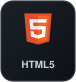&nbsp;
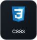&nbsp;
&nbsp;
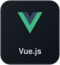&nbsp;

### Backend

&nbsp;
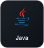&nbsp;
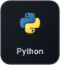&nbsp;

### Base de Datos

&nbsp;
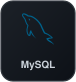&nbsp;
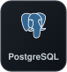

### Herramientas

&nbsp;
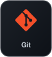&nbsp;
&nbsp;
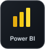&nbsp;
&nbsp;
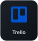&nbsp;
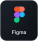

 

<!-- FOOTER -->

  

  

